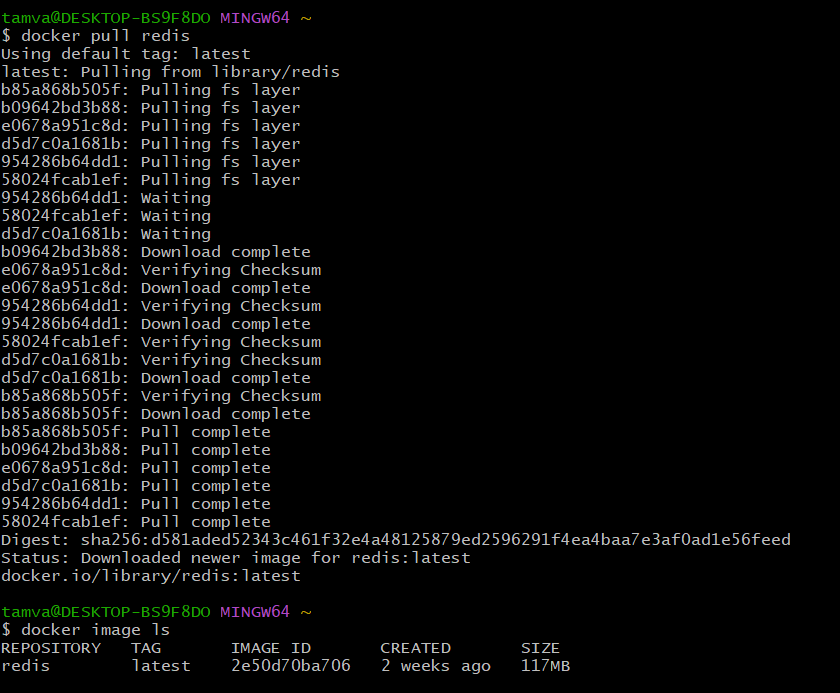

untuk menginstall image dari docker hub bisa menggunakan command berikut:

docker pull nama_image:version

- note: jika version tidak diisi maka secara default akan memilih latest version
- penggunaan: docker pull redis
- list image: https://hub.docker.com/search?q=

